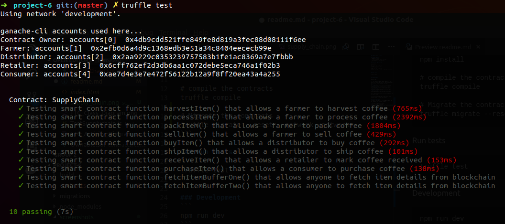
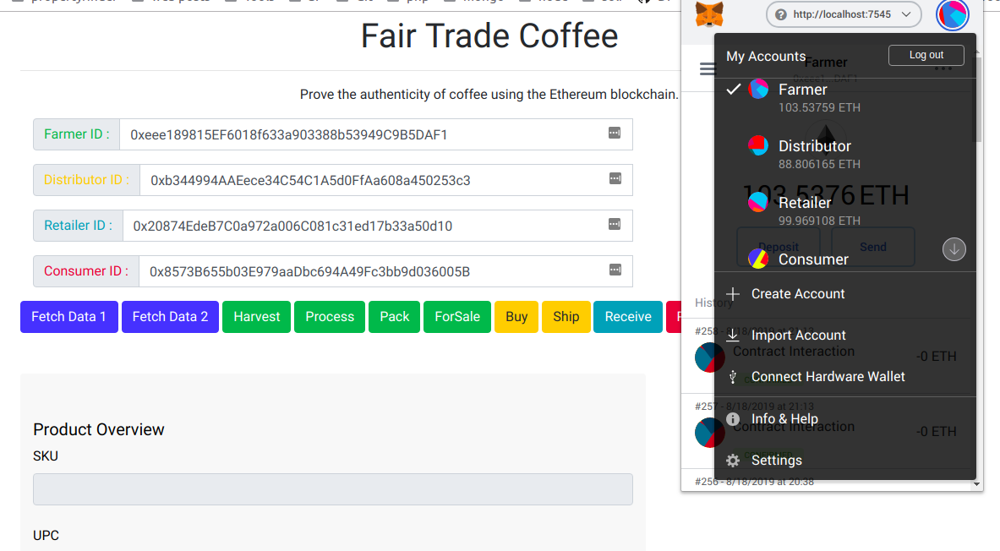

## Supply Chain Project

### Requirements
- NodeJS v8.11.4
- Truffle v4.1.14 (core: 4.1.14)
- Solidity v0.4.24 (solc-js)
- Metamask

### Install Application
```
npm install

# compile the contracts
truffle compile

# Migrate the contracts
truffle migrate --reset --network <network>
```

### Run tests
```
truffle test
```
You should get the following results :



### Development
```
npm run dev
```
To run the development mode, make sure you have 4 different wallets for each stakeholder, to interact with the smart contract.
Ex. :
- <font color='#28a745'>**farmer**</font> : 0xeee189815EF6018f633a903388b53949C9B5DAF1
- <font color='#ffc107'>**distributor**</font> : 0xb344994AAEece34C54C1A5d0FfAa608a450253c3
- <font color='#17a2b8'>**retailer**</font> : 0x20874EdeB7C0a972a006C081c31ed17b33a50d10
- <font color='#dc3545'>**consumer**</font> : 0x8573B655b03E979aaDbc694A49Fc3bb9d036005B

These Metamask accounts are generated with the following seed :
```
source because organ gun lumber pond donor vanish sunset crucial menu insect
```


Once, you have your application running, with the proper accounts in Metamask.
You can follow the lifecycle of the Coffee bag, by interacting with the smart-contracts (click on the action buttons)

\* *You have to select the proper Metamask account to interact with the smart-contract.*

### Public Network
The smart contract for the Supply Chain, can be found on the Rinkeby network.

- Contract transaction hash : https://rinkeby.etherscan.io/tx/0x43fbb58ef9aee69fb76c4772e9bc2e4962b16a11951d1761cb1338a427dfa681

- Contract Address :
https://rinkeby.etherscan.io/address/0x04b664f4b7b208e32c4469c042d1464fccb1aee7